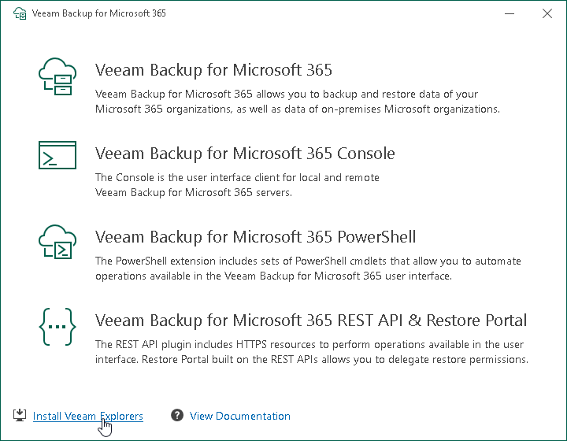

# Step 2. Select Component

At this step of the wizard, click the Install Veeam Explorers link. This link is available only if you run the installation wizard on a server with Veeam Backup & Replication.

To open Veeam Help Center from the installation wizard, click View Documentation.

