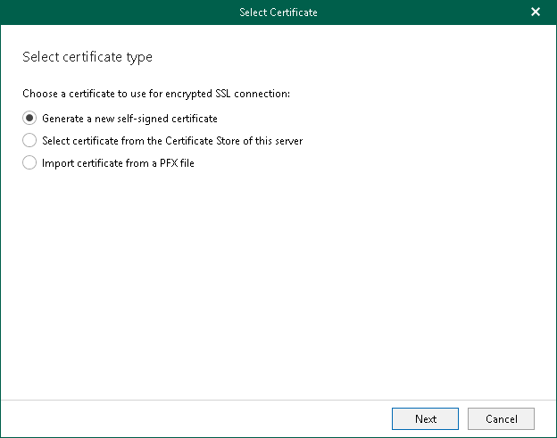
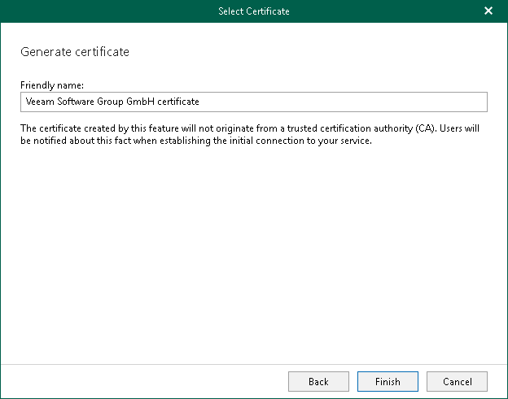

In this article

To install an SSL certificate from the Veeam Backup for Microsoft 365 console main menu, do the following:

1. In the main menu, click General Options.
2. Open either the REST API, or Restore Portal, or Security, or Authentication tab.
3. Click Install to run the Select Certificate wizard.
4. Proceed to any of the following options:

* [Generate a new self-signed certificate](#generate_new)
* [Select certificate from the Certificate Store of this server](#selecting_file)
* [Import certificate from a PFX file](#import)

Generating New Certificate

To generate a new certificate, specify a certificate name and click Finish.

Selecting Certificate

To select an existing certificate from the certificate store, select a certificate that you want to use and click Finish.

For communicating with backup proxy server, Veeam Backup for Microsoft 365 requires a certificate from the Trusted Root Certification Authorities certificate store. In other usage scenarios, use a certificate from the Personal\Certificates directory. The certificate key must be exportable. For more information about an SSL certificate usage scenarios, see [SSL Certificate Usage Scenarios](vbo_ssl_usage_scenarios.md).

Importing Certificate

To import a certificate, do the following:

1. Click Browse and select a PFX file to use.
2. In the Password field, specify the certificate password.
3. Click Finish.

Page updated 2/14/2025

Page content applies to build 8.3.0.2201
