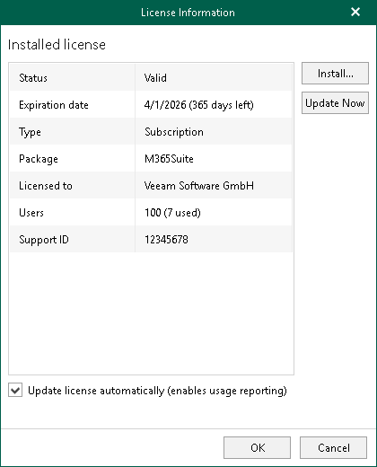
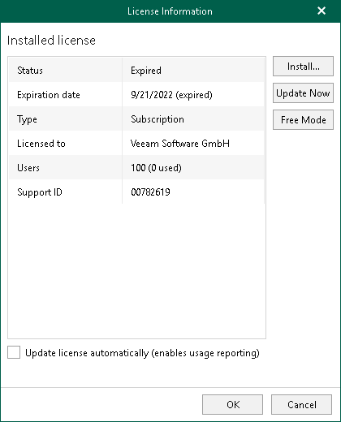

In this article

After you install Veeam Backup for Microsoft 365, you will be prompted to provide a license. You can dismiss this step and continue using the product without any license installed. In this case, the product will operate in the Community Edition mode that allows you to process up to 10 user accounts, up to 1 TB of Microsoft SharePoint data and up to 10 teams in all organizations. Community Edition mode is not limited in time and does not have limitations in terms of the product functionality.

Installing Fully-Functional License

You can purchase and install a fully-functional license if you plan to back up more than 10 user accounts, more than 1 TB of Microsoft SharePoint data or more than 10 teams. For more information about available license types in Veeam Backup for Microsoft 365, see [Licensing and License Types](vbo_licensing.md).

The number of user accounts that you will be able to back up depends on the purchase agreement with Veeam sales representatives. You can find how many accounts Veeam Backup for Microsoft 365 can protect in the Users row of the [License Information](#lic) window.

To install a license, do the following:

1. In the main menu, click License.
2. In the License Information window, click Install and specify the path to the .lic file.
3. If you install Rental or Subscription license, Veeam Backup for Microsoft 365 prompts you whether the product can update your license automatically when you renew or expand your contract. If you agree, in the displayed window, click Yes.

The Update license automatically check box in the License Information window will be selected automatically.

|  |
| --- |
| Note |
| If you allow Veeam Backup for Microsoft 365 to update your license automatically, the following data will be periodically sent to the Veeam servers:   * License ID * Installation ID * License usage counters |

Updating License

You can update an existing license, for example, if you want to extend the number of protected user accounts that you need to back up.

To update an existing license, click Update Now and wait until Veeam Backup for Microsoft 365 downloads and installs the license.

To enable automatic updates of your current license, select the Update license automatically check box.

|  |
| --- |
| Note |
| To use the Update license automatically option, make sure to open the required port to access the Veeam auto-update server. For more information, see [Ports](vbo_used_ports.md). |

Updating License Package for Veeam ONE Monitoring

For Veeam Backup for Microsoft 365 with Subscription license, Veeam ONE monitoring is available if the M365Suite license package is installed. If you have selected the Update license automatically check box before the product upgrade to version 8.3, Veeam Backup for Microsoft 365 license package will be updated automatically from M365 to M365Suite during the next 7 days after the product upgrade.

To update the license manually, click Update Now.

Switching to Community Edition Mode

If your previous license has expired, you can switch to the Community Edition mode and use Veeam Backup for Microsoft 365 without any license installed.

The Community Edition mode allows you to process up to 10 user accounts, up to 1 TB of Microsoft SharePoint data and up to 10 teams in all organizations. This mode is not limited in time and does not have limitations in terms of the product functionality.

To use Veeam Backup for Microsoft 365 in the Community Edition mode, click Free Mode.

Page updated 4/1/2025

Page content applies to build 8.3.0.2201
