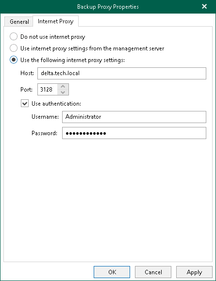

# Configuring Internet Proxy Server

Veeam Backup for Microsoft 365 allows you to assign an internet proxy server to a backup proxy server that does not have direct access to the internet.

To configure an internet proxy server for a backup proxy server, do the following:

1. On the Internet Proxy tab, select one of the following options:

* Do not use internet proxy. Select this option if your backup proxy server has direct access to the internet and you do not want to use any other internet proxy servers.

* Use internet proxy settings from the management server. Select this option to use an internet proxy that is configured for your management server.

For more information, see [Global Internet Proxy Server Settings](vbo_configuring_internet_proxy.md).

* Use the following internet proxy settings. Select this option to configure a dedicated internet proxy server and specify the following:

* In the Host field, enter a DNS name or IP address of a server that has access to the internet and which you want to use as an internet proxy.
* In the Port files, specify a port number which you use to connect to the specified server.
* Select the Use authentication check box to authenticate yourself on a server and provide authentication credentials.

1. Click OK.

|  |
| --- |
| Note |
| The local backup proxy server (that is, the default backup proxy server) always uses an internet proxy that is configured for your management server. For more information, see [Global Internet Proxy Server Settings](vbo_configuring_internet_proxy.md). |

