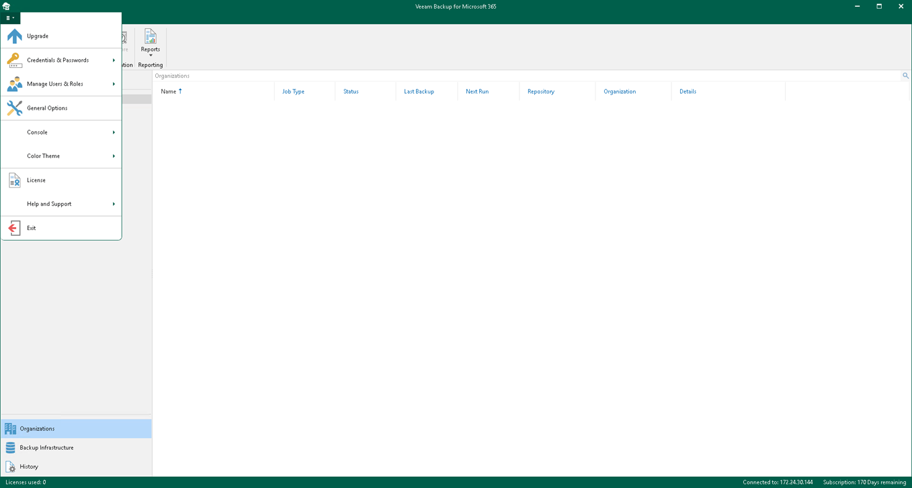
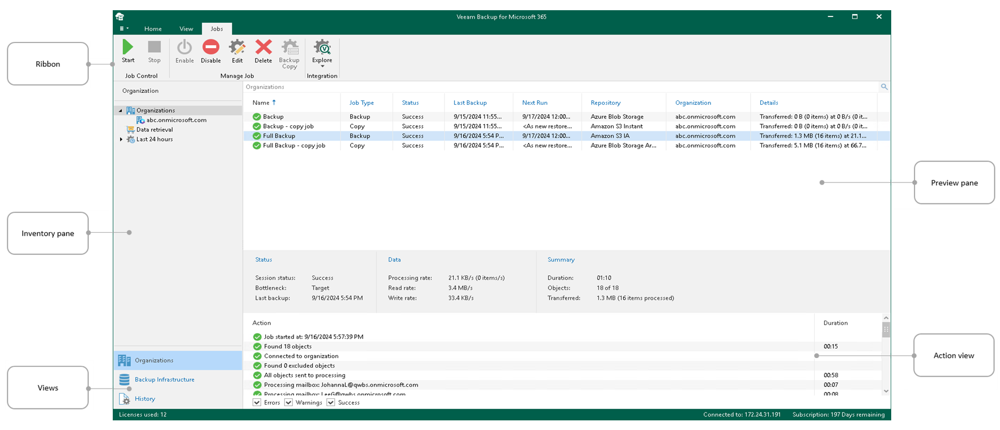

In this article

The user interface of Veeam Backup for Microsoft 365 is designed to let you quickly find commands that you need to protect data of Microsoft organizations against disasters and configure backup infrastructure.

Main Menu

The main menu comprises the following:

* Upgrade. Allows you to update Veeam Backup for Microsoft 365 manually. For more information, see [Checking for Updates](vbo_checking_for_updates.md).

* Credentials & Passwords.

* Manage Cloud Credentials. Allows you to manage cloud credentials that you use to access object storage repositories. For more information, see [Managing Cloud Credentials](managing_cloud_credentials.md).
* Manage Passwords. Allows you to manage encryption passwords. For more information, see [Managing Encryption Passwords](managing_passwords.md).

* Manage Users & Roles.

* Users & Roles. Allows you to manage a list of users and user groups that have permissions to access the Veeam Backup for Microsoft 365 console and Veeam Explorers, and to configure multi-factor authentication (MFA). For more information, see [Managing Users and Roles](manage_users_roles.md) and [Multi-Factor Authentication](mfa.md).
* Restore Operator Roles. Allows you to manage restore operator roles that you add in the operator restore scenario for data restore using Restore Portal. For more information, see [Adding Restore Operator Role](ssp_adding_operator_roles.md).

* General Options. Allows you to configure general application settings. For more information, see [General Settings](vbo_general_application_settings.md).
* Console.

* PowerShell. Opens the PowerShell toolkit.
* Swagger. Opens the swagger website. Unavailable until you enable the REST service and usage of Swagger UI. For more information, see [REST API Settings](vbo_rest_api_settings.md).

* Color Theme. Contains four different color schemes that you can select for the Veeam Backup for Microsoft 365 console.
* License. Shows license information. For more information, see [Installing and Updating License](vbo_installing_license.md).

* Help and Support.

* Online help. Opens the online help page.
* Support information. Launches the support information collection wizard. For more information, see [Collecting Log Files for Veeam Backup for Microsoft 365 Components](vbo_exporting_logs.md) and [Collecting Log Files for Backup and Backup Copy Jobs](vbo_exporting_logs_jobs.md).

* About. Shows the additional information including build number.

* Exit. Closes the Veeam Backup for Microsoft 365 console window.

Main Application Window

The main application window can be divided into five categories:

* The views switch that allows you to switch among the following infrastructure views:

* The Organizations view is intended to work with Microsoft organizations, as well as backup, backup copy and retrieval jobs. It provides search capabilities and statistics for recently performed backup, backup copy, retrieve, restore and data management sessions.
* The Backup Infrastructure view displays a list of backup infrastructure components: backup proxy servers, backup proxy pools, JET-based backup repositories and object storage repositories. You can use this view for backup infrastructure setup — here you can configure backup infrastructure components that will be used for data backup, backup copy and restore of backed-up data.
* The History view displays statistics on backup, backup copy, retrieve, restore and data management sessions performed with Veeam Backup for Microsoft 365. Also, it allows you to search for backup, backup copy, retrieve, restore and data management sessions using keywords.

* The inventory pane that displays a hierarchy or list of items relevant for a specific view. Lists are displayed in the preview pane.

Items displayed in the inventory pane differ depending on the active view. For example, in the Organizations view, the inventory pane displays the following nodes:

* The Organizations node that includes Microsoft organizations added to the scope and a list of backup and backup copy jobs configured for these organizations. Also, it allows you to search for backup and backup copy jobs using keywords.
* The Data retrieval node with a list of retrieval jobs and their statuses. Keep in mind that this node is displayed only if you have created a retrieval job.
* The Last 24 hours node with the list of backup, backup copy, retrieve, restore and data management sessions performed within the last 24 hours and their statuses. Also, it allows you to search for backup, backup copy, retrieve, restore and data management sessions using keywords.

In the Backup Infrastructure view, the inventory pane displays nodes for backup infrastructure components — backup proxy servers, backup proxy pools, JET-based backup repositories and object storage repositories. The Backup Repositories node includes the following nodes for different backup repositories added to Veeam Backup for Microsoft 365:

* Object storage. Contains S3 Compatible object storage repositories, Azure Blob Storage Hot/Cool access tiers, Amazon S3 Standard, Amazon S3 Standard-Infrequent Access and Amazon S3 One Zone-Infrequent Access storage classes.
* Local disk. Contains Default Backup Repository and other JET-based backup repositories.
* Archive. Contains Azure Blob Storage Archive access tier and all Amazon S3 Glacier storage classes.

For more information, see [Supported Azure Storage Account Types](supported_storage_account_types.md) and [Supported Amazon S3 Storage Classes](supported_storage_classes_amazon.md).

Keep in mind that the Archive and Object storage nodes are displayed only if you have added a particular object storage repository.

* The ribbon that contains operation commands organized into logical groups represented as tabs. The ribbon is displayed at the top of the main application window.

On the ribbon, the following tabs are displayed:

* The Home tab provides quick access to the most common operations. It lets you manage organizations, create backup jobs, explore backed-up data, retrieve data from backup copies and configure reports. This tab is always available, no matter which view is currently active.
* Other tabs contain commands specific for certain items and appear when these items are selected in the inventory or preview pane.

* The View tab allows you to switch between the compact and full view modes.
* The Jobs tab contains commands specific for backup and backup copy jobs.
* The Backup Proxy tab contains commands specific for backup proxy servers.
* The Backup Proxy Pool tab contains commands specific for backup proxy pools.
* The Backup Repository tab contains commands specific for backup repositories.
* The Retrievals tab contains commands specific for retrieval jobs.
* The Last 24 Hours tab allows you to stop backup, backup copy, retrieve, restore and data management sessions.

|  |
| --- |
| Tip |
| Commands for operations with items in Veeam Backup for Microsoft 365 are also available from the shortcut menu. |

* The preview pane that provides search capabilities and shows you, for example, a list of backup and backup copy jobs configured for the selected organization.
* The action view that allows you to view details about backup and backup copy jobs progress and results.

|  |
| --- |
| Tip |
| To open online help, press [F1] in any Veeam Backup for Microsoft 365 wizard or window. |

Page updated 10/14/2025

Page content applies to build 8.3.0.2201
