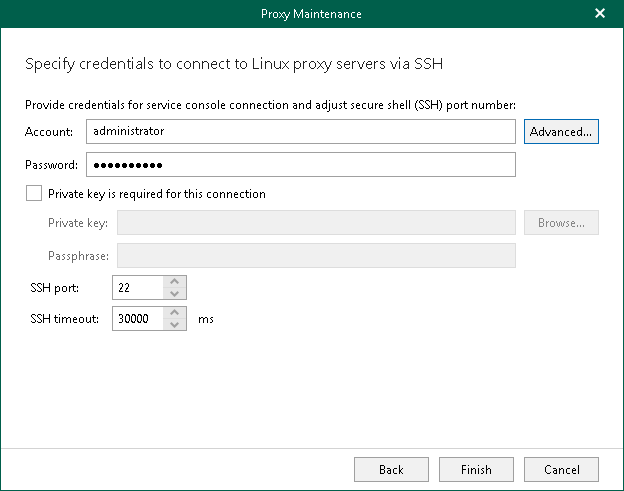

In this article

This step is available if you have selected Linux-based backup proxy server at the [Select Backup Proxy Server](vbo_selecting_proxy_server_maintenance.md) step of the wizard.

At this step of the wizard, enter a user account credentials to connect to the backup proxy server and configure the SSH connection settings.

|  |
| --- |
| Note |
| If you want to enable the maintenance mode for multiple Linux-based backup proxy servers, you must specify the SSH connection settings that Veeam Backup for Microsoft 365 can use to connect to all selected Linux-based backup proxy servers. |

To configure the SSH connection settings, do the following:

1. In the Account field, enter a user name.
2. In the Password field, enter a password. The password is required in all cases except when you use a user with enabled NOPASSWD:ALL setting in /etc/sudoers.
3. If you specified credentials for a non-root account that does not have root permissions on a Linux machine, click Advanced to grant the sudo rights to this account. For more information, see [Configuring Advanced Settings](#advanced).
4. Select the Private key is required for this connection check box if you want to use the Identity/Pubkey authentication method. For more information, see [Using Identity/Pubkey Authentication](#identity_pubkey_auth).

Do the following:

1. In the Private key field, enter a path to the private key or click Browse to select a private key.
2. In the Passphrase field, specify a passphrase for the private key on the Veeam Backup for Microsoft 365 server.

1. In the SSH Port field, specify a number of the SSH port to connect to a Linux machine. By default, port 22 is used.
2. In the SSH Timeout field, specify the SSH connection timeout. This timeout is used to wait for connection to the specified backup proxy server through SSH. The default value is 30000 milliseconds.

Configuring Advanced Settings

To grant the sudo rights to the non-root account, in the Advanced Settings window, do the following:

1. Select the Elevate specified account to root check box to provide a non-root user with root account privileges.
2. Select the Add account to the sudoers file automatically check box to add the user account to the sudoers file. In the Root password field, enter the password for the root account.

|  |
| --- |
| Note |
| If you do not select the Add account to the sudoers file automatically check box, you must add the user account to the sudoers file manually. |

1. Select the Use su if sudo is unavailable check box to enable failover using the su command for distros where the sudo command is not available. In the Root password field, enter the password for the root account.

Using Identity/Pubkey Authentication

The Identity/Pubkey authentication method helps to protect against malicious applications like keyloggers, strengthens the security level and simplifies launch of automated tasks.

To use the Identity/Pubkey authentication method, you must generate a pair of keys — a public key and private key:

* Public key is stored on Linux machine to which you plan to connect. The key is kept in a special authorized\_keys file containing a list of public keys.
* Private key is stored on the Veeam Backup for Microsoft 365 server. The private key is protected with a passphrase. Even if the private key is intercepted, the eavesdropper will have to provide the passphrase to unlock the key and use it.

For authentication on a Linux machine, the client must prove that it has the private key matching the public key stored on the Linux machine. To do this, the client generates a cryptogram using the private key and passes this cryptogram to the Linux machine. If the client uses the "correct" private key for the cryptogram, the Linux machine can decrypt the cryptogram with a matching public key.

For more information about supported key algorithms and key formats, see [Supported Key Algorithms and Key Formats](key_algorithms.md).

Page updated 4/1/2025

Page content applies to build 8.3.0.2201
