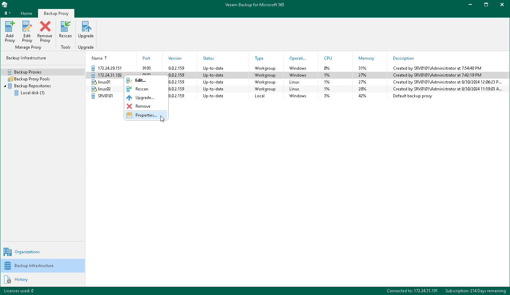

In this article

Veeam Backup for Microsoft 365 allows you to configure backup proxy server properties. In contrast with the editing of backup proxy server settings, modifying backup proxy server properties does not lead to adding backup proxy anew to the Veeam Backup for Microsoft 365 backup infrastructure. You just apply new values for the modified parameters.

To configure backup proxy server properties, do the following:

1. Open the Backup Infrastructure view.
2. In the inventory pane, select the Backup Proxies node.
3. In the preview pane, right-click a backup proxy server, select Properties and proceed to:

* [Configuring Network Bandwidth](vbo_threads_and_limit.md)
* [Configuring Internet Proxy Server](vbo_internet_proxy.md)

|  |
| --- |
| Note |
| The Properties option is unavailable if a backup proxy server needs to be upgraded. For more information about upgrading backup proxy servers, see [Upgrading Backup Proxy Servers](vbo_upgrading_proxy_server.md). |

Page updated 8/30/2024

Page content applies to build 8.3.0.2201
