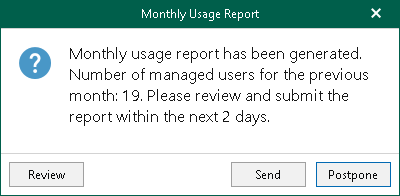
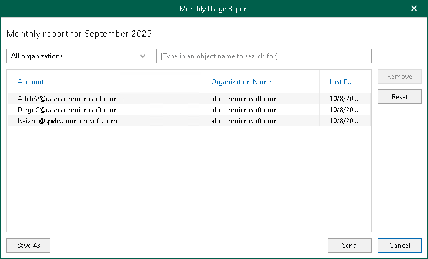

In this article

When using a rental license, service providers can manually submit a monthly usage report. Such reports contain information on processed user accounts per each Microsoft organization added to the Veeam Backup for Microsoft 365 backup infrastructure.

Veeam Backup for Microsoft 365 displays the Monthly Usage Report notification message during the 3-day period starting from the first day of each month. During this period, the notification message appears every time you launch Veeam Backup for Microsoft 365 until you send your monthly usage report to Veeam. After you submit the report, Veeam Backup for Microsoft 365 stops displaying the notification message.

If you do not submit a monthly usage report to Veeam during the 3-day period, Veeam Backup for Microsoft 365 stops displaying the notification message and sends the report to Veeam automatically. Sending the monthly usage report to Veeam from the Veeam Backup for Microsoft 365 user interface becomes unavailable, but you can review the report — Veeam Backup for Microsoft 365 automatically saves it to the %ProgramData%\Veeam\Backup365\Reports folder in PDF and CSV formats.

|  |
| --- |
| Note |
| If Veeam Backup for Microsoft 365 is integrated with Veeam Service Provider Console, the product will not notify you about the necessity to submit a monthly usage report. For more information, see [Integration with Veeam Products](integration_vspc.md#vspc). |

When the Monthly Usage Report window appears, do one of the following:

* Click Review to open the Monthly Usage Report window and review details of a monthly usage report.
* Click Send to send the report immediately to Veeam.
* Click Postpone to postpone your actions to the next launch of the product.

Reviewing and Sending Reports

To review details of a monthly usage report, in the Monthly Usage Report window, click Review.

By default, Veeam Backup for Microsoft 365 lists all backed-up user accounts of all Microsoft organizations added to the product scope.

Before sending a monthly usage report, Veeam Backup for Microsoft 365 allows you to review a list of backed-up user accounts. You can do the following:

* Select a particular Microsoft organization from the drop-down list to view all backed-up user accounts of this organization.

* Use the search field to find user accounts of the selected organization.

* Exclude user accounts from the monthly usage report. To do this, select a user account in the list and click Remove. Veeam Backup for Microsoft 365 will prompt you to provide the removal reason.

|  |
| --- |
| Tip |
| To reset changes introduced in the report, click Reset. |

You can save your monthly usage report as a PDF or CSV file. To do this, click Save As and specify a location.

To submit a monthly usage report to Veeam, click Send.

Page updated 10/9/2025

Page content applies to build 8.3.0.2201
