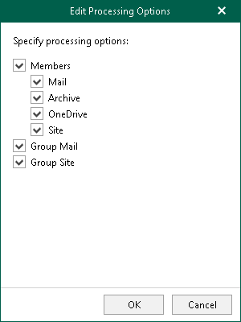
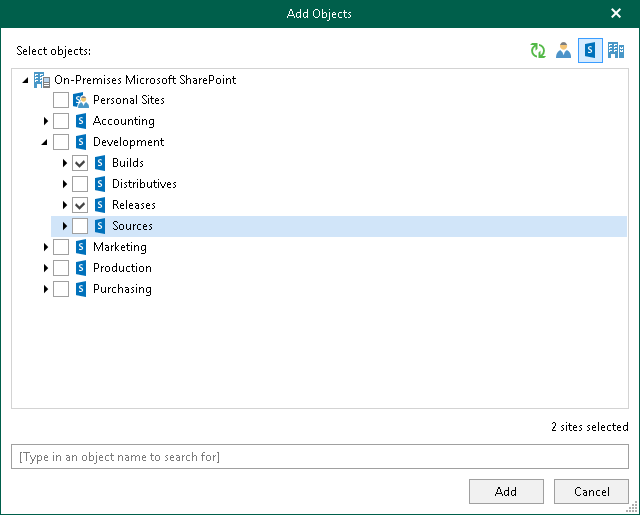

In this article

Veeam Backup for Microsoft 365 allows you to specify object types and their processing and exclusion options when creating and configuring backup jobs.

The following object types are available for [backup](vbo_data_backup.md) and [restore](vbo_data_restore.md):

* [Organizations](#organizations)

Consists of organization objects and their processing options.

* [Groups](#groups)

Consists of Microsoft 365 groups (available only in Microsoft 365 organizations), security groups, distribution groups and dynamic distribution groups.

* [Users](#users)

Consists of shared mailboxes, public mailboxes and users.

* [Sites](#sites)

Consists of Microsoft SharePoint sites and subsites.

* [Teams](#teams)

Consists of Microsoft Teams teams.

Each of these object types (except for the Site type) consists of a set of processing/exclusion options which you can select/clear to make data backup even more precise. For example, for the M365 Group type, you can specify the Mail, Archive, OneDrive, Site, Group Mail and Group Site processing/exclusion options.

Processing and exclusion options can be selected at the [Select Objects to Back Up](select_objects_to_backup.md) and [Select Objects to Exclude](select_objects_to_exclude.md) steps of the New Backup Job wizard.

Organizations

The following table lists processing/exclusion options available for Organization type:

| Options for Microsoft 365 Organizations | Options for On-premises Microsoft Exchange Organizations | Options for On-premises Microsoft SharePoint Organizations |
| --- | --- | --- |
| Mail, Archive, OneDrive, Sites, Teams and Teams chats | Mail and Archive | OneDrive and Sites |

Groups

The following table lists available Group types and their processing/exclusion options:

| Group Type | Options for Microsoft 365 Organizations | Options for On-premises Microsoft Exchange Organizations |
| --- | --- | --- |
| M365 Group (available only in | When configuring Microsoft 365 organizations, the following set of processing/exclusion options is available:   * Members with Mail, Archive, OneDrive and Site * Group Mail * Group Site   Note: Veeam Backup for Microsoft 365 does not back up the TeamsMessagesData folder. | N/A |
| Security Group | Members with Mail, Archive, OneDrive and Site options, including members of nested security groups | Members with Mail and Archive options, including members of nested security groups |
| Distribution Group | Members with Mail, Archive, OneDrive and Site options | Members with Mail and Archive options |
| Dynamic Distribution Group | N/A | Members with Mail and Archive options |

|  |
| --- |
| Note |
| Groups are not available in on-premises Microsoft SharePoint organizations. |

Users

The following table lists available User types and their processing/exclusion options:

| User Type | Options for Microsoft 365 Organizations | Options for On-premises Microsoft Exchange Organizations | Options for On-premises Microsoft SharePoint Organizations |
| --- | --- | --- | --- |
| User | Mail, Archive, OneDrive and Site  Note: Veeam Backup for Microsoft 365 backs up SharePoint sites and OneDrive accounts content that belongs to a user account added to a backup job. | Mail and Archive | OneDrive and Site |
| Shared Mailbox (available only in Microsoft 365 and Exchange organizations)1 | N/A |
| Public Mailbox (available only in Microsoft 365 and Exchange organizations)1 |
| Discovery Search Mailbox (available only in Microsoft 365 and Exchange organizations)1  Note: Displayed with the User type. |

1To back up public folder and discovery search mailboxes as well as determine correctly object type for shared mailboxes in Microsoft 365 organizations with modern app-only authentication, Veeam Backup for Microsoft 365 requires the Exchange.ManageAsApp permission and the Global Reader role granted to a Microsoft Entra application. For more information, see [Permissions for Backup](ad_app_permissions_sd.md#Exchange.ManageAsApp) and [Granting Global Reader Role to Microsoft Entra Application](ad_app_permissions_sd.md#app_role).

Sites

Consider the following:

* Objects of the Site type do not have any processing/exclusion options.
* You can select either the root site, or any of its subsites.

In the following example, you can select either the root Development site which automatically selects all of its subsites, or you can select, for example, Builds and Releases. In the latter case, the root Development site will not be selected.

Teams

Consider the following:

* Objects of this type are available in Microsoft 365 organizations only.
* Microsoft Teams service is not supported for organizations in Microsoft Entra China region.
* When you add an object of this type to a backup job, Veeam Backup for Microsoft 365 backs up the following objects:

* [Team chats](#team_chats).

To back up team chats, Veeam Backup for Microsoft 365 uses Microsoft Graph Teams Export APIs. You can use Teams Export APIs for team chats backup only for Microsoft 365 organizations with modern app-only authentication.

* Document library for the SharePoint team site, private and shared channels.

* Team metadata, for example, settings of the team, information about team members, channels, tabs, applications.

* Veeam Backup for Microsoft 365 does not back up the TeamsMessagesData folder of the group mailbox that belongs to the Microsoft 365 group associated with the backed-up team.

The following table lists processing options available for objects of the Team type:

| Options for Microsoft 365 Organizations with Modern App-Only Authentication | Options for Microsoft 365 Organizations with Modern Authentication and Legacy Protocols1 | Options for Microsoft 365 Organizations with Basic Authentication1 |
| --- | --- | --- |
| Chats and Channels, tabs, files, membership  Note: Channels, tabs, files, membership of a team are always processed. | Channels, tabs, files, membership | Channels, tabs, files, membership |

1You can continue to use Veeam Backup for Microsoft 365 to back up and restore data of Microsoft 365 organizations that were added to previous installations of the product using legacy authentication methods.

Team Chats Backup

Veeam Backup for Microsoft 365 backs up Microsoft Teams messages using Microsoft Graph Teams Export APIs.

Teams Export APIs allow Veeam Backup for Microsoft 365 to access sensitive data of team chats: private and shared channels, and public channel messages. When you add a Microsoft 365 organization, Veeam Backup for Microsoft 365 automatically configures access to Teams Export APIs and grants permissions to back up such objects. For more information, see [Permissions for Modern App-Only Authentication](ad_app_permissions_sd.md#backup).

Consider the following:

* Team chats backup is only supported for Microsoft 365 organizations with modern app-only authentication.
* Team chats backup is not supported for Microsoft organizations in Microsoft Entra China, US Government DOD and US Government GCC High regions.

For more information about Teams Export APIs, see [this Microsoft article](https://docs.microsoft.com/en-us/microsoftteams/export-teams-content).

To enable team chats backup for Microsoft 365 organizations, do the following:

1. In the Add Organization or Edit Organization wizard, select the Teams chats check box when adding a new Microsoft 365 organization with modern app-only authentication or editing an existing one. If you do not select this check box, Veeam Backup for Microsoft 365 will not back up team chats. For more information, see [Select Organization Deployment Type](vbo_add_o365_sd.md).
2. Do one of the following to enable access for an existing Microsoft Entra application to Microsoft Teams private and shared channels, and public channel messages:

* In the Add Organization or Edit Organization wizard, allow Veeam Backup for Microsoft 365 to grant automatically the ChannelMessage.Read.All (for channel messages) and ChannelMember.Read.All (for private and shared channels) Microsoft Graph API permissions to an existing Microsoft Entra application when adding a new Microsoft 365 organization with modern app-only authentication or editing an existing one. For more information, see [Using Existing Microsoft Entra Application](register_ad_application.md#uea).
* In Microsoft Identity platform, grant manually the ChannelMessage.Read.All (for channel messages) and ChannelMember.Read.All (for private and shared channels) Microsoft Graph API permissions to this Microsoft Entra application. For more information, see [Permissions for Modern App-Only Authentication](ad_app_permissions_sd.md#backup).

Page updated 11/27/2025

Page content applies to build 8.3.0.2201
