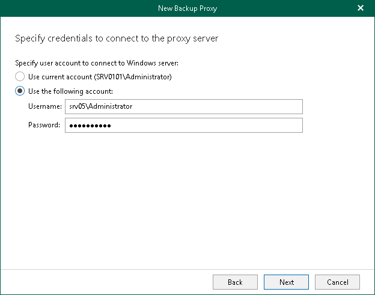

# Step 4. Specify Credentials

At this step of the wizard, enter a user account credentials to connect to the [specified computer](vbo_proxy_server_address.md).

|  |
| --- |
| Note |
| The account must be a member of the local Administrators group. |

To do this, select one of the following options:

* Use current account. Select this option to connect to the backup proxy server using credentials under which you are currently logged in.
* Use the following account. Select this option to connect to the backup proxy server using credentials that you must specify in the Username and Password fields.

Veeam Backup for Microsoft 365 uses the specified credentials for different purposes depending on the type of the backup proxy:

* For a domain backup proxy, Veeam Backup for Microsoft 365 uses credentials for entire communication with the backup proxy server.

* For a workgroup backup proxy, Veeam Backup for Microsoft 365 uses credentials only to connect to a computer in a workgroup and upload backup proxy server components to this machine. After the backup proxy is deployed, Veeam Backup for Microsoft 365 uses an SSL certificate to communicate with the backup proxy server.

