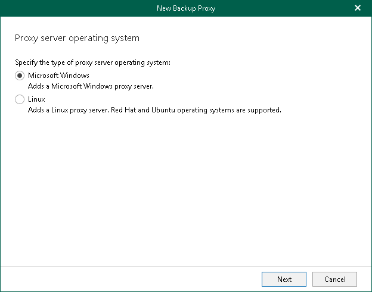

In this article

At this step of the wizard, select Microsoft Windows to assign a role of the backup proxy server to a machine with Microsoft Windows operating system installed. For more information, see [System Requirements](vbo_system_requirements.md#BackupProxy).

Page updated 8/29/2024

Page content applies to build 8.3.0.2201
