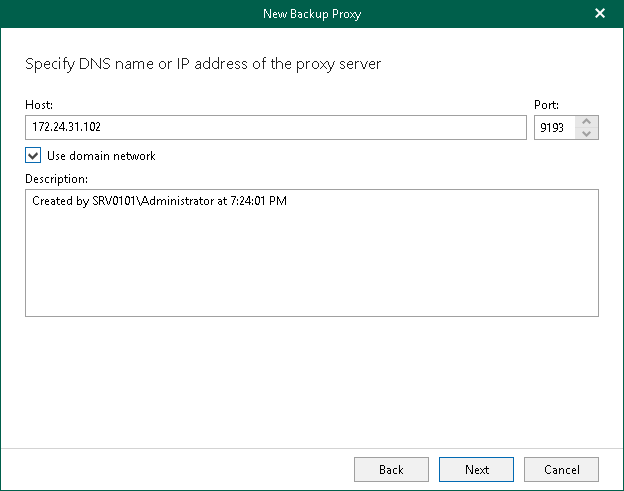

In this article

At this step of the wizard, specify a computer that you want to use as a backup proxy server, its port number and optional description.

|  |
| --- |
| Note |
| Veeam Backup for Microsoft 365 requires the Veeam Backup for Microsoft 365 server and a backup proxy server to be reachable to each other by their DNS name. |

Do the following:

1. In the Host field, enter a DNS name or IP address of a computer that you want to use as a backup proxy server.

If the specified computer does not have a direct access to the internet, you can [configure an internet proxy server](vbo_internet_proxy.md) for such a computer.

Make sure that the default admin share ADMIN$ (C:\Windows) is enabled on the specified computer.

1. In the Port field, enter a port number to access the specified computer.
2. If you want to add a domain backup proxy server, select the Use domain network check box. Otherwise, Veeam Backup for Microsoft 365 will add a workgroup backup proxy server. For more information, see [Deployment Scenarios for Windows-based Backup Proxy Servers](vbo_backup_proxy_servers.md#deployment).

|  |
| --- |
| Note |
| Once the backup proxy server is deployed, you will not be able to change its type from the domain backup proxy to the workgroup backup proxy and vice versa. |

1. In the Description field, enter optional description.

Page updated 9/6/2024

Page content applies to build 8.3.0.2201
