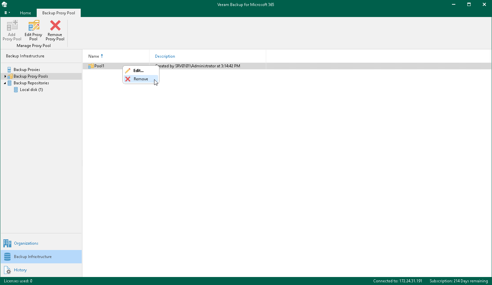

# Removing Backup Proxy Pools

You can remove a backup proxy pool from the Veeam Backup for Microsoft 365 backup infrastructure if you no longer need it. Keep in mind that when you remove the backup proxy pool, you only remove the logical grouping of the backup proxy servers. All backup proxy servers themselves are kept in the Veeam Backup for Microsoft 365 backup infrastructure.

To remove a backup proxy pool from the backup infrastructure, do the following:

1. Open the Backup Infrastructure view.
2. In the inventory pane, select the Backup Proxy Pools node.
3. In the preview pane, do one of the following:

* Select a backup proxy pool and click Remove Proxy Pool on the ribbon.

* Right-click a backup proxy pool and select Remove.

