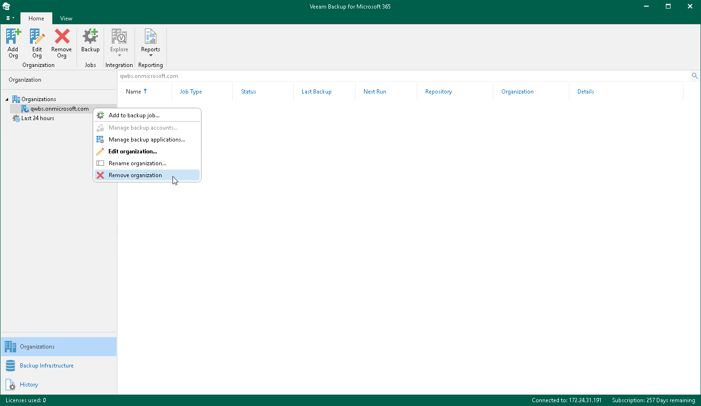

In this article

You can remove an organization from the Veeam Backup for Microsoft 365 console if you no longer need it.

Consider the following:

* Backup jobs configured for the organization that you are removing will be permanently deleted.
* When removing an organization, its backups will not be removed. For JET-based backup repositories, you can open the backed-up data as a separated database in Veeam Explorers. For more information, see the following sections:

* [Veeam Explorer for Microsoft Exchange](https://helpcenter.veeam.com/docs/vbo365/explorers/adding_exchange_databases.html?ver=80)
* [Veeam Explorer for Microsoft SharePoint](https://helpcenter.veeam.com/docs/vbo365/explorers/vesp_adding_vbo_databases.html?ver=80)
* [Veeam Explorer for Microsoft OneDrive for Business](https://helpcenter.veeam.com/docs/vbo365/explorers/veod_adding_vbo_databases_od.html?ver=80)
* [Veeam Explorer for Microsoft Teams](https://helpcenter.veeam.com/docs/vbo365/explorers/vet_adding_vbo_databases.html?ver=80)

If backups are stored in an object storage repository, you must re-add an organization to Veeam Backup for Microsoft 365 to access the backed-up data and get restore points for this object storage repository. For example, you can get restore points for the object storage repository by running the [Get-VBORestorePoint](https://helpcenter.veeam.com/docs/vbo365/powershell/get-vborestorepoint.html?ver=80) cmdlet.

To remove an organization, do the following:

1. Open the Organizations view.
2. In the inventory pane, select an organization.
3. Do one of the following:

* On the Home tab, click Remove Org on the ribbon.
* Right-click an organization and select Remove organization.

Page updated 8/29/2024

Page content applies to build 8.3.0.2201
