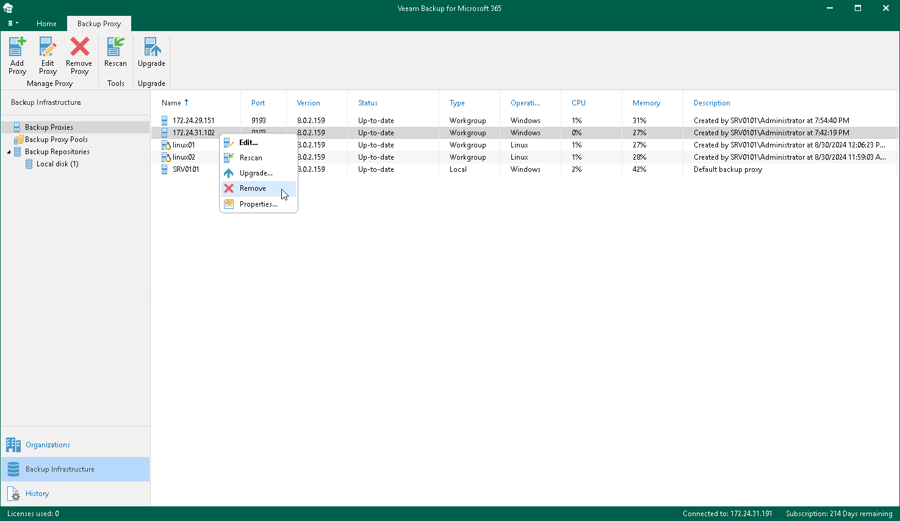

# Removing Backup Proxy Servers

You can remove a backup proxy server from the Veeam Backup for Microsoft 365 backup infrastructure if you no longer need it.

Consider the following:

* A default backup proxy server cannot be removed.
* Veeam Backup for Microsoft 365 Proxy Service will be uninstalled from the target machine.

* Backup data and log files will be preserved.
* You can remove a backup proxy server that you have put under maintenance.

To remove a backup proxy server from the backup infrastructure, do the following:

1. Open the Backup Infrastructure view.
2. In the inventory pane, select the Backup Proxies node.
3. In the preview pane, do one of the following:

* Select a backup proxy server and click Remove Proxy on the ribbon.

* Right-click a backup proxy server and select Remove.

Related Topics

[Maintenance Mode](maintenance_mode.md)

