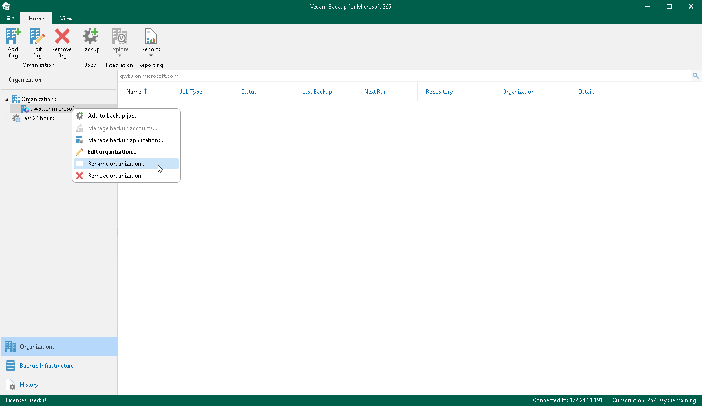
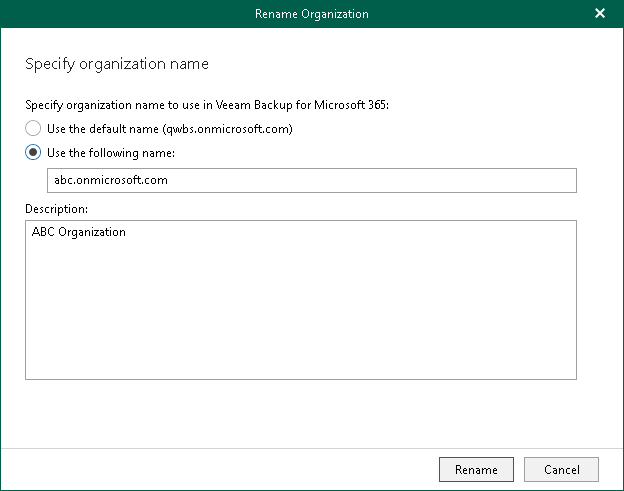

In this article

You can rename your Microsoft 365 and on-premises Microsoft organizations. Keep in mind that you change the organization name that is displayed only in the Veeam Backup for Microsoft 365 console.

To rename an organization, do the following:

1. Open the Organizations view.
2. In the inventory pane, right-click an organization and select Rename organization.

1. In the Rename Organization wizard, do the following:

1. Select one of the following options:

* Use the default name. Select this option to continue using the default organization name.
* Use the following name. Select this option to specify a custom name.

When selecting this option, provide a new name.

Consider that when creating a [Mailbox Protection Reports](mailbox_protection_reports.md) and [User Protection Reports](user_protection_reports.md), organizations will be shown with their default names.

1. In the Description field, enter optional description.
2. Click Rename.

Page updated 7/18/2024

Page content applies to build 8.3.0.2201
