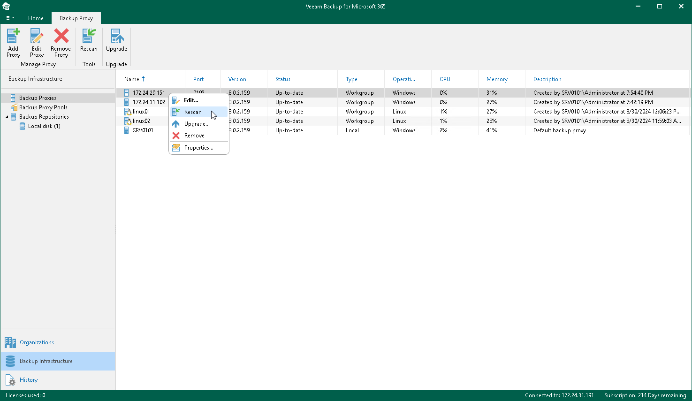

In this article

Rescan is required if some of your backup proxy servers are unavailable.

To rescan a backup proxy server, do the following:

1. Open the Backup Infrastructure view.
2. In the inventory pane, select the Backup Proxies node.
3. In the preview pane, do one of the following:

* Select a backup proxy server and click Rescan on the ribbon.

* Right-click a backup proxy server and select Rescan.

If you want to rescan all backup proxy servers in your environment, right-click the Backup Proxies node and select Rescan.

Page updated 8/30/2024

Page content applies to build 8.3.0.2201
