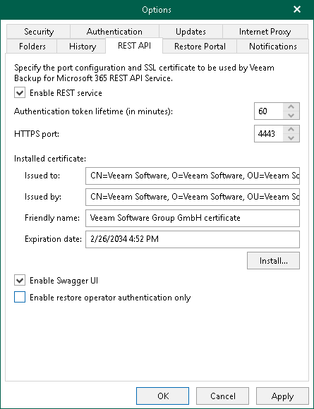

In this article

You can use REST API to communicate with Veeam Backup for Microsoft 365. For more information, see [REST API Reference](https://helpcenter.veeam.com/references/vbo365/8/rest/).

Also, REST API is used by Restore Portal to communicate with the Veeam Backup for Microsoft 365 server. Restore Portal allows users to perform self-service restore. For more information about Restore Portal, see [Data Restore Using Restore Portal](ssp_restore.md).

To configure Veeam Backup for Microsoft 365 REST API settings, do the following:

1. In the main menu, click General Options.
2. Open the REST API tab.
3. Select the Enable REST service check box.
4. In the Authentication token lifetime field, specify the lifetime value for an authentication token (in minutes).

REST API authorization is based on the [OAuth 2.0 Authorization Framework](https://datatracker.ietf.org/doc/html/rfc6749).

1. In the HTTPS port field, specify a port number which you use to access Veeam Backup for Microsoft 365 REST API Service.

Also, Restore Portal uses this port to communicate with Veeam Backup for Microsoft 365 REST API Service. For more information, see [Ports](vbo_used_ports.md).

|  |
| --- |
| Note |
| The default value is 4443. If you use a different port, make sure that you configure the same value for the Restore Portal web address. Otherwise, Restore Portal will be unavailable. For more information, see [Register or Configure Microsoft Entra Application](ssp_create_new_app_2.md). |

1. Click Install to run the Select Certificate wizard.
2. Proceed to any of the following options:

* [Generate a new self-signed certificate](vbo_installing_certificate.md#generate_new)

* [Select certificate from the Certificate Store of this server](vbo_installing_certificate.md#selecting_file)
* [Import certificate from a PFX file](vbo_installing_certificate.md#import)

Keep in mind that Restore Portal also uses this SSL certificate to communicate with the Veeam Backup for Microsoft 365 server and perform restore operations through REST API.

1. Select the Enable Swagger UI check box to enable access to the swagger website and usage of Swagger UI.
2. Select the Enable restore operator authentication only check box to use REST API only for authentication of restore operators to Restore Portal. Keep in mind that if you enable this check box, all other REST API endpoints will be unavailable.
3. Click OK.

Page updated 2/14/2025

Page content applies to build 8.3.0.2201
