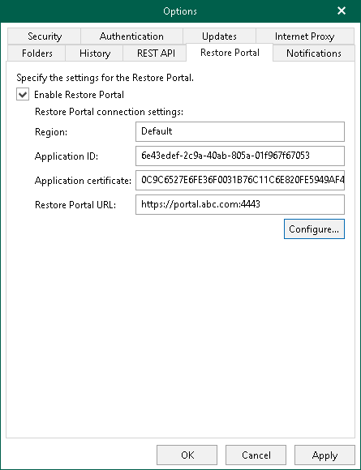

In this article

Veeam Backup for Microsoft 365 provides users with the ability to explore and restore data from backups by themselves or delegate this task to restore operators. In these scenarios, Veeam Explorers are not needed to explore and restore backed-up data. Users use Restore Portal — a web-based solution instead and perform all operations in a web browser window. You configure the Restore Portal settings if you want to allow users to perform self-service restore. For more information about Restore Portal, see [Data Restore Using Restore Portal](ssp_restore.md).

|  |
| --- |
| Note |
| If you want to use Restore Portal to restore backed-up data of Microsoft 365 organizations that belong to [different regions](vbo_add_o365_2_sd.md), you must use a separate installation of the Veeam Backup for Microsoft 365 REST API component and a separate Microsoft Entra application in each Microsoft Entra region. |

To configure the Restore Portal settings, do the following:

1. In the main menu, click General Options.
2. Open the Restore Portal tab.
3. Select the Enable Restore Portal check box.
4. Do one of the following:

* Register a new Microsoft Entra application automatically

To do this, click Configure and follow the steps of the Configure Application wizard. For more information, see [Creating or Configuring Microsoft Entra Application](ssp_create_new_app_wizard.md).

Veeam Backup for Microsoft 365 automatically grants the [required permissions](ssp_ad_application_permissions.md) to the Microsoft Entra application that you create and generates an SSL certificate. For more information, see [Registering New Microsoft Entra Application](ssp_create_new_app_2.md#cna).

* Configure an existing Microsoft Entra application

To do this, click Configure and follow the steps of the Configure Application wizard. For more information, see [Creating or Configuring Microsoft Entra Application](ssp_create_new_app_wizard.md).

Veeam Backup for Microsoft 365 checks the Microsoft Entra application permissions, grants the missing [permissions](ssp_ad_application_permissions.md) if needed and updates an SSL certificate. For more information, see [Configuring Existing Microsoft Entra Application](ssp_create_new_app_2.md#conf_ea).

1. Click OK.

Related Topics

* [REST API Settings](vbo_rest_api_settings.md)
* [Authentication Settings](vbo_authentication_settings.md)

Page updated 4/1/2025

Page content applies to build 8.3.0.2201
