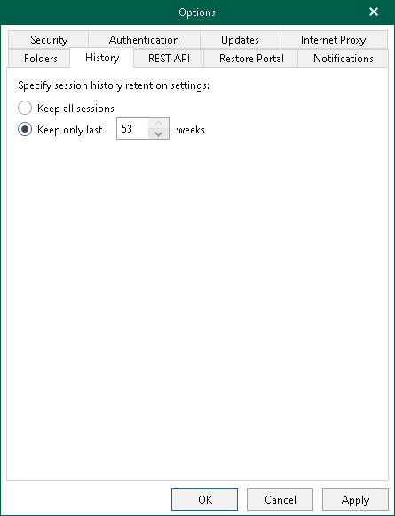

# Session History

Veeam Backup for Microsoft 365 saves information about backup, backup copy, retrieve, restore and data management sessions to the configuration database. You can review this information. For more information, see [Backup, Backup Copy, Retrieve, Restore and Data Management Statistics](vbo_backup_job_statistics.md).

To specify a period during which Veeam Backup for Microsoft 365 keeps information about backup, backup copy, retrieve, restore and data management sessions, do the following:

1. In the main menu, click General Options.
2. Open the History tab.
3. Specify for how long Veeam Backup for Microsoft 365 will keep history for backup, backup copy, retrieve, restore and data management sessions.

You can select one of the following options:

* Keep all sessions
* Keep only last <N> weeks

If you select this option, you can specify a number of weeks during which Veeam Backup for Microsoft 365 will keep history for backup, backup copy, retrieve, restore and data management sessions.

1. Click OK.

