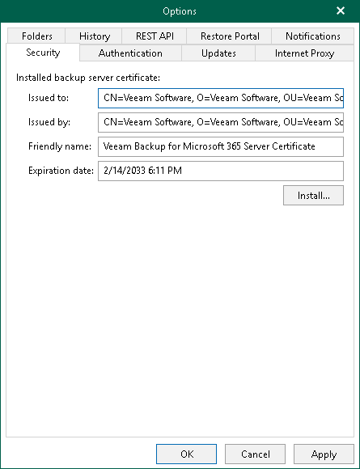

In this article

Veeam Backup for Microsoft 365 uses an SSL certificate to communicate with a backup proxy server deployed in a workgroup. By default, Veeam Backup for Microsoft 365 uses a certificate automatically generated by the product during the installation process. You can view this certificate or install a custom certificate, if necessary.

To configure security settings, do the following:

1. In the main menu, click General Options.
2. Open the Security tab.
3. In the Installed backup server certificate section, review information about the certificate that is used to establish a connection with a backup proxy server deployed in a workgroup.
4. If you want to use another certificate, click Install to run the Select Certificate wizard.
5. Proceed to any of the following options:

* [Generate a new self-signed certificate](vbo_installing_certificate.md#generate_new)

* [Select certificate from the Certificate Store of this server](vbo_installing_certificate.md#selecting_file)
* [Import certificate from a PFX file](vbo_installing_certificate.md#import)

1. Click OK.

Veeam Backup for Microsoft 365 will install a new certificate. If a previously installed certificate is already used by one or more workgroup backup proxy servers, Veeam Backup for Microsoft 365 will connect to these backup proxy servers and update certificate settings. After that, the Veeam Backup for Microsoft 365 server and backup proxy servers will communicate using the new certificate.

Page updated 2/14/2025

Page content applies to build 8.3.0.2201
