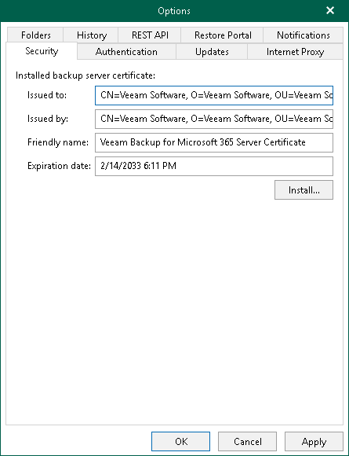

# Security Settings

Veeam Backup for Microsoft 365 uses a TLS certificate to communicate with a backup proxy server deployed in a workgroup. By default, this certificate is generated automatically by the product during the installation process. If required, you can replace it in the security settings.

To configure security settings, do the following:

1. In the main menu, click General Options.
2. Open the Security tab.
3. In the Installed backup server certificate section, review the default Veeam Backup for Microsoft 365 server certificate. If you want to replace it, click Install to run the Select Certificate wizard. Proceed to any of the following options:

Generate a new self-signed certificate

|  |
| --- |
| Perform the following steps:   1. Select the Generate a new self-signed certificate option.      1. Specify a certificate name and click Finish.    |

Import an existing TLS certificate from the certificate store

|  |  |  |
| --- | --- | --- |
| Perform the following steps:   1. Select the Select certificate from the Certificate Store of this server option.      1. Select the certificate from the certificate store and click Finish.   |  | | --- | | Note | | A TLS certificate that you want to use must be added to the Trusted Root Certification Authorities certificate store. It also must have a private exportable key. |   |

Import a TLS certificate from a file in the PFX format

|  |  |  |
| --- | --- | --- |
| Perform the following steps:   1. Select the Import certificate from a PFX file option.      1. Click Browse and select a PFX file. Specify the certificate password if required.   |  | | --- | | Note | | A TLS certificate that you want to use must have a private exportable key. |     1. Click Finish. |

|  |
| --- |
| Note |
| If you replace a certificate that is already used by one or more backup proxy servers, Veeam Backup for Microsoft 365 will connect to these servers and update certificate settings. After that, the Veeam Backup for Microsoft 365 server and backup proxy servers will communicate using the new certificate. |

1. Click OK.

