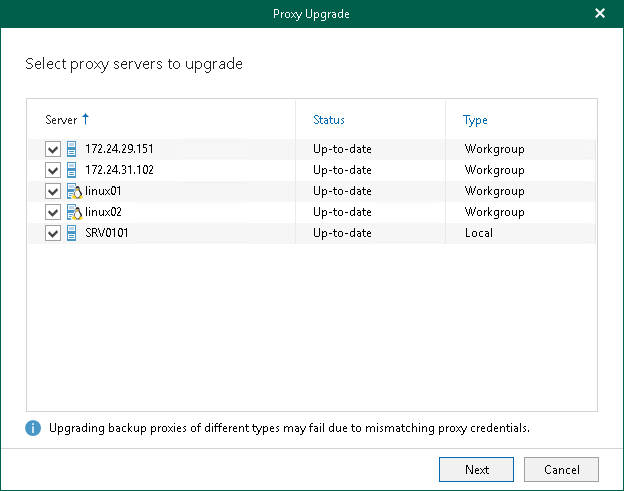

# Step 2. Select Backup Proxy Server to Upgrade

At this step of the wizard, select a backup proxy server to upgrade. You can select multiple backup proxy servers at the same time.

The local backup proxy server (that is, the default backup proxy server) will be upgraded automatically.

