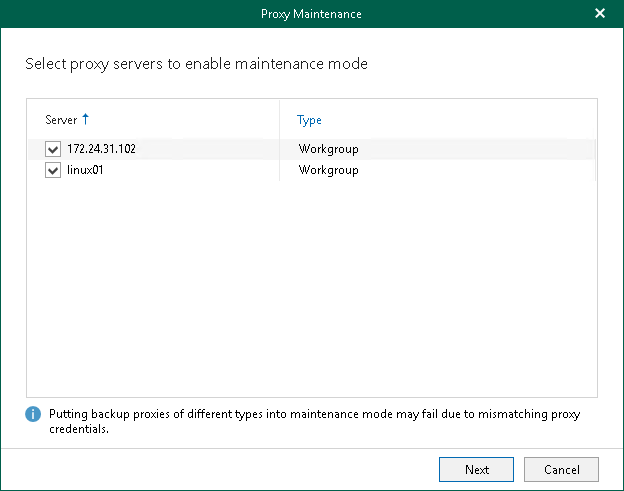

In this article

At this step of the wizard, select a backup proxy server for which you want to enable the maintenance mode. You can select multiple backup proxy servers at the same time.

Page updated 8/27/2024

Page content applies to build 8.3.0.2201
