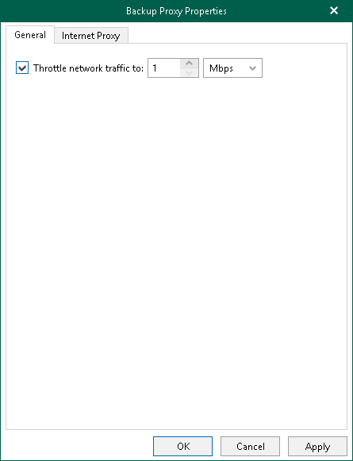

# Configuring Network Bandwidth

Veeam Backup for Microsoft 365 allows you to limit download speed.

To limit download speed, do the following:

1. On the General tab, select the Throttle network traffic to check box and specify the average download speed.

For example, if you have set this value to 10 Mbps and have downloaded 100 Mb in 8 seconds, Veeam Backup for Microsoft 365 will stop retrieving new data for approximately 2 minutes after which download will be resumed automatically. The exact time for which Veeam Backup for Microsoft 365 stops getting data is calculated by predefined algorithms and depends upon the value that you specify as traffic throttling, the amount of downloaded data and the amount of time it took to get this data.

1. Click OK.

