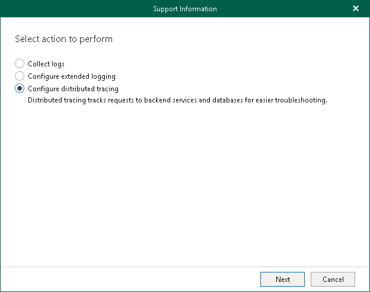
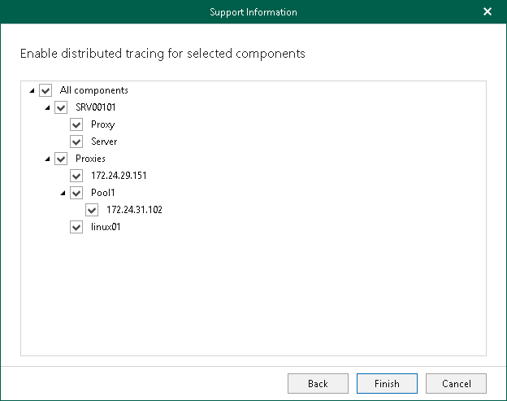

In this article

Distributed tracing tracks activities of the Veeam Backup for Microsoft 365 backup infrastructure components and their communication through the NATS server and allows you to analyze the activity of services. Veeam Backup for Microsoft 365 saves trace files in the same folder as log files.

Veeam Customer Support specialists use traces to troubleshoot product operation issues and may ask you to enable distributed tracing after you report a problem to Veeam Customer Support.

To enable distributed tracing, do the following:

1. In the main menu, click Help and Support > Support information.
2. Select the Configure distributed tracing option.

1. Select components (local or remote) to which you want to enable distributed tracing.

1. Click Finish.

After you enable distributed tracing, you need to go back to the main application window and perform actions for which you want to collect traces. Then you can collect logs along with trace files. For more information, see [Collecting Log Files for Veeam Backup for Microsoft 365 Components](vbo_exporting_logs.md) and [Collecting Log Files for Backup and Backup Copy Jobs](vbo_exporting_logs_jobs.md).

Page updated 9/9/2025

Page content applies to build 8.3.0.2201
