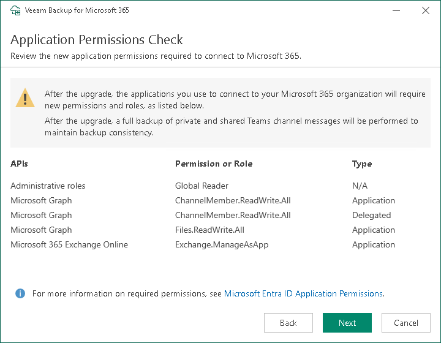

# Step 5. Review Microsoft Entra Application Permissions

|  |
| --- |
| Note |
| This step is only available if you upgrade Veeam Backup for Microsoft 365 from version 7.0 or 7a to version 8.3. |

At the Application Permission Check step, you can review new permissions and roles that must be granted to the Microsoft Entra application to [back up](vbo_data_backup.md) and [restore](vbo_data_restore.md) data of your Microsoft 365 organizations with modern app-only authentication.

You can update permissions of the Microsoft Entra application manually. For more information, see [What You Do After Upgrade](after_upgrade.md).

The following table lists new permissions and roles:

| API | Permission or role name | Type | Usage | Description |
| --- | --- | --- | --- | --- |
| Microsoft Graph | ChannelMember.ReadWrite.All | Application | Backup, Restore | Accessing and restoring Microsoft Teams private and shared channels. |
| ChannelMember.ReadWrite.All | Delegated | Restore | Reading the current state and restoring Microsoft Teams private and shared channels. |
| Files.ReadWrite.All | Application | Restore | Reading the current state and restoring files of Microsoft Teams shared channels. |
| Office 365 Exchange Online | Exchange.ManageAsApp | Application | Backup | Accessing Exchange Online PowerShell to do the following:   * Back up public folder and discovery search mailboxes. * Determine object type for shared mailboxes as Shared Mailbox. |
| Administrative role | Global Reader | N/A | Backup |

Related Topics

[Permissions for Modern App-Only Authentication](ad_app_permissions_sd.md)

