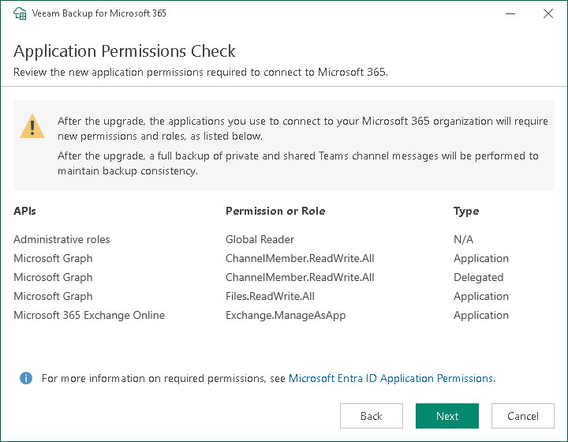

# Step 5. Review Microsoft Entra Application Permissions

At the Application Permission Check step, you can review new permissions that must be granted to the Microsoft Entra application to [back up](vbo_data_backup.md) and [restore](vbo_data_restore.md) data of your Microsoft 365 organizations with modern app-only authentication.

You can update permissions of the Microsoft Entra application manually. For more information, see [What You Do After Upgrade](after_upgrade.md).

The following table lists new permissions:

Step 5. Review Microsoft Entra Application Permissions

| API | Permission name | Type | Usage | Description |
| Microsoft Graph | User.Read.All | Application | Backup, restore | Accessing Exchange mailboxes that belong to a user (getting mailbox IDs). |
| User.Read.All | Delegated | Restore | Accessing Exchange mailboxes that belong to a user (getting mailbox IDs). |
| MailboxItem.ImportExport.All | Application | Backup, restore | Exporting Exchange mailbox item data and creating a session to import an Exchange mailbox item. |
| MailboxItem.ImportExport | Delegated | Restore | Creating a session to import an Exchange mailbox item. |
| MailboxItem.Read.All | Application | Backup, restore | Accessing Exchange mailbox items to do the following:   * Get mailbox item properties. * Get mailbox items that were added, deleted, or updated in a mailbox folder. |
| MailboxItem.Read | Delegated | Restore | Accessing Exchange mailbox items within a mailbox folder in a mailbox. |
| MailboxFolder.ReadWrite.All | Application | Restore | Accessing Exchange mailbox folders. |
| MailboxFolder.ReadWrite | Delegated | Restore | Creating a new mailbox folder or subfolder in a user mailbox. |

Related Topics

[Permissions for Modern App-Only Authentication](ad_app_permissions_sd.md)

