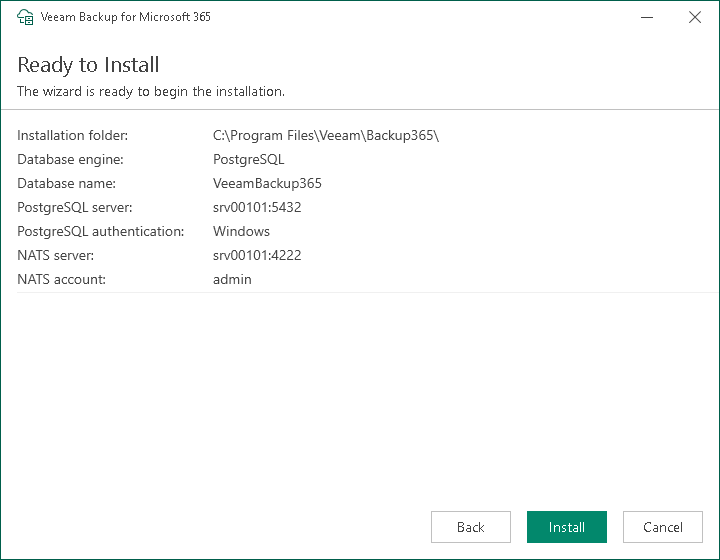
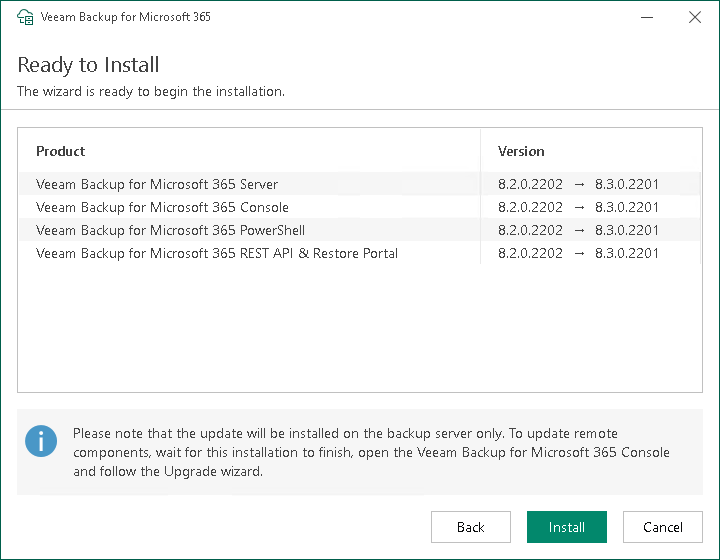

In this article

|  |
| --- |
| Note |
| Depending on the version from which you upgrade Veeam Backup for Microsoft 365 to version 8.3, this step is displayed in two variants. |

Upgrade from Version 7.0 or 7a

This step is only available if you have selected to configure installation settings manually at the [Review Default Installation Settings](vbo_upgrade_default_settings.md) step of the wizard.

At the Ready to Install step, review the custom installation settings and click Install to start the installation process.

Wait for the installation process to complete and click Finish to exit the wizard.

Upgrade from Version 8 or 8.x

At the Ready to install step, review versions of Veeam Backup for Microsoft 365 components that are ready to upgrade and click Install to start the installation process.

Wait for the installation process to complete and click Finish to exit the wizard.

Page updated 12/16/2025

Page content applies to build 8.3.0.2201
