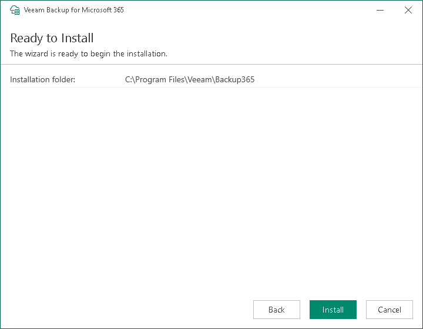

In this article

This step is only available if you have selected to configure installation settings manually at the [Review Default Installation Settings](vbo_upgrade_default_settings_rest.md) step of the wizard.

At the Ready to Install step, review the custom installation settings and click Install to start the installation process.

Wait for the installation process to complete and click Finish to exit the wizard.

Page updated 7/16/2024

Page content applies to build 8.3.0.2201
