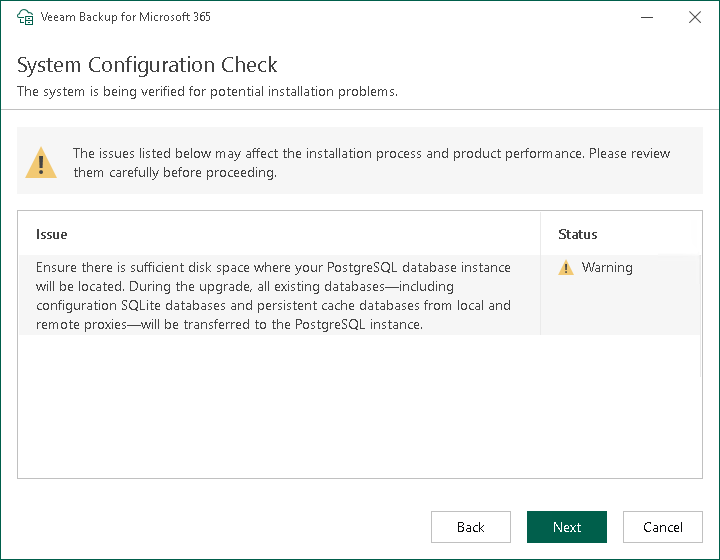

In this article

At the System Configuration Check step, the installation wizard checks the system configuration to find potential installation problems and installs Microsoft .NET Framework 4.7.2 if it is missing on the target machine. If the wizard detects problems, you will be prompted to fix the issues to continue the installation.

If the wizard cannot install Microsoft .NET Framework 4.7.2 automatically, install it manually and click Retry. After the software component is successfully installed, reboot may be required. To reboot the machine, click Reboot.

|  |
| --- |
| Note |
| Veeam Backup for Microsoft 365 requires sufficient free space on a local disk of the target machine to transfer existing databases and to deploy PostgreSQL. For more information on the hardware recommendations, see [System Requirements](vbo_system_requirements.md#ManagementServer). |

Page updated 8/28/2025

Page content applies to build 8.3.0.2201
