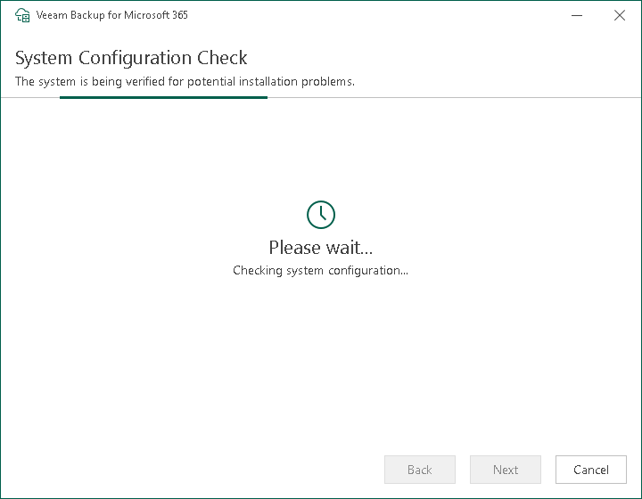

In this article

At the System Configuration Check step, the installation wizard checks the system configuration to find potential installation problems and installs Microsoft .NET Framework 4.7.2 if it is missing on the target machine. If the wizard detects problems, you will be prompted to fix the issues to continue the installation.

If the wizard cannot install Microsoft .NET Framework 4.7.2 automatically, install it manually and click Retry. After the software component is successfully installed, reboot may be required. To reboot the machine, click Reboot.

|  |
| --- |
| Note |
| If problems are not detected, the System Configuration Check step will be skipped. For more information on the required software, see [System Requirements](vbo_system_requirements.md). |

Page updated 7/16/2024

Page content applies to build 8.3.0.2201
