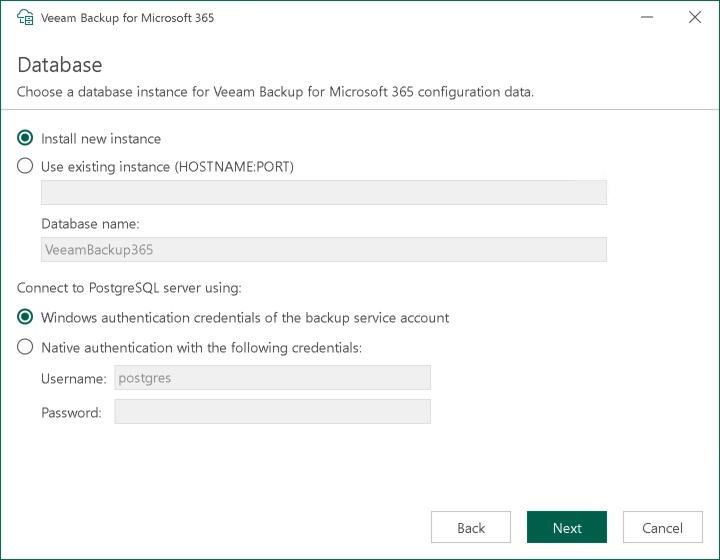

# Step 7. Configure PostgreSQL Instance

|  |
| --- |
| Note |
| This step is only available if you upgrade Veeam Backup for Microsoft 365 from version 7.0 or 7a to version 8.3 and you have selected to configure installation settings manually at the [Review Default Installation Settings](vbo_upgrade_default_settings.md) step of the wizard. |

At the Database step, specify settings for the PostgreSQL instance where you want to deploy the Veeam Backup for Microsoft 365 configuration database, and select the authentication mode. For more information about a PostgreSQL instance, see [PostgreSQL Instance](architecture.md#postgresql).

To specify settings for the PostgreSQL instance, do the following:

1. Select one of the following options:

* Install new instance. Select this option to install a new PostgreSQL instance. The upgrade wizard will deploy PostgreSQL 15.14 on the target machine and create a database with the VeeamBackup365 name.
* Use existing instance. Select this option to use an already installed PostgreSQL instance. Do the following:

1. Enter the instance name in the <host\_name>:<port> format.
2. In the Database name field, specify a name for the Veeam Backup for Microsoft 365 configuration database.

|  |
| --- |
| Important |
| If you use the already installed PostgreSQL instance or make any changes in the machine hardware, right after you deploy Veeam Backup for Microsoft 365, perform the additional configuration of the PostgreSQL instance. For more information, see [Adjusting PostgreSQL Instance Configuration](adjust_postgres_instance.md). |

1. Select an authentication mode to connect to the database server instance: Microsoft Windows authentication or native database server authentication. If you select the native authentication, enter credentials of the database account.

If a configuration database with the specified name already exists (for example, it was created by a previous installation of Veeam Backup for Microsoft 365), the upgrade wizard will notify about it. To connect to the detected database, click Yes. If necessary, Veeam Backup for Microsoft 365 will automatically upgrade the database to the latest version.

