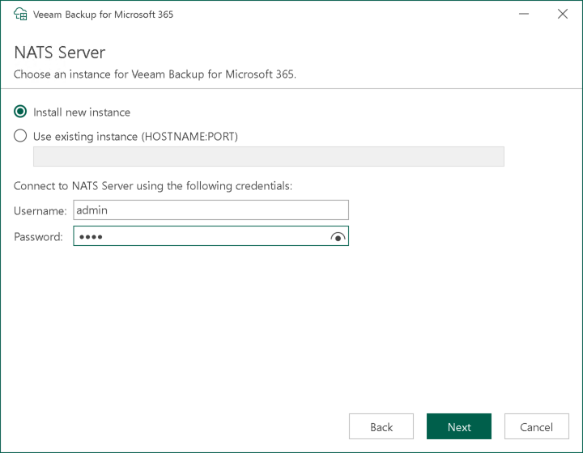

In this article

|  |
| --- |
| Note |
| This step is only available if you upgrade Veeam Backup for Microsoft 365 from version 7.0 or 7a to version 8.3 and you have selected to configure installation settings manually at the [Review Default Installation Settings](vbo_upgrade_default_settings.md) step of the wizard. |

At the NATS Server step, specify settings to connect to the NATS server. For more information about the NATS server, see [NATS Server](architecture.md#nats).

To specify connection settings for the NATS server, do the following:

1. Select one of the following options:

* Install new instance. Select this option to install a new NATS server instance on the target machine.
* Use existing instance. Select this option to use an already installed NATS server instance and enter the instance name in the <host\_name>:<port> format.

1. Specify credentials to connect to the NATS server.

|  |
| --- |
| Important |
| By default, the NATS server that you deploy along with Veeam Backup for Microsoft 365 on the target machine does not use the TLS encryption. For more information, see [Enabling TLS Encryption on NATS Server](adjust_nats_instance.md). |

Page updated 1/17/2025

Page content applies to build 8.3.0.2201
