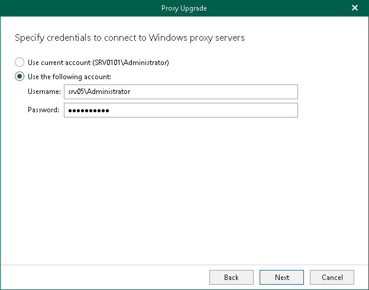

# Step 3. Specify Credentials

This step is available if you have selected to upgrade a Windows-based backup proxy server at the [Select Backup Proxy Server to Upgrade](vbo_selecting_proxy_server.md) step of the wizard.

At this step of the wizard, enter user credentials to connect to the backup proxy server.

|  |
| --- |
| Note |
| Consider the following:   * The account must be a member of the local Administrators group. * If you want to upgrade multiple Windows-based backup proxy servers, you must specify a user account that Veeam Backup for Microsoft 365 can use to connect to all selected Windows-based backup proxy servers. |

To do this, select one of the following options:

* Use current account. Select this option to connect to the backup proxy server using credentials under which you are currently logged in.
* Use the following account. Select this option to connect to the backup proxy server using credentials that you must specify in the Username and Password fields.

