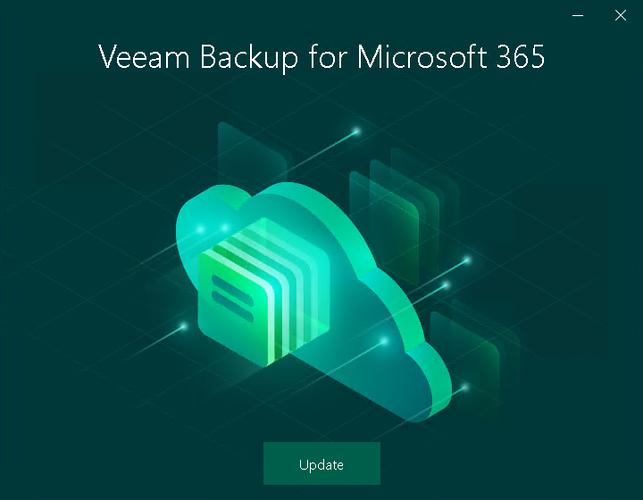
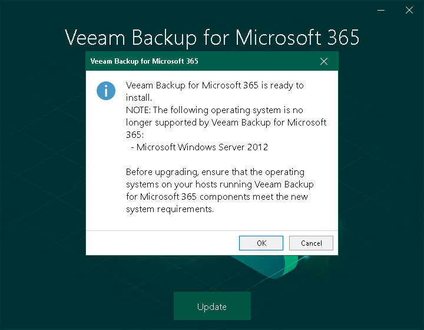

# Step 1. Launch Upgrade Wizard

To launch the upgrade wizard, do the following:

1. Download the Veeam Backup for Microsoft 365 installation package. For more information, see [Downloading Installation Package](download_package.md).
2. Open the Veeam.Backup365.iso file and run the Veeam.Setup.exe file.
3. On the splash screen, click Update.

1. In the displayed dialog box, read the information about operating systems that Veeam Backup for Microsoft 365 version 8 does not support. If your operating system meets [system requirements](vbo_system_requirements.md#ManagementServer), click OK.

