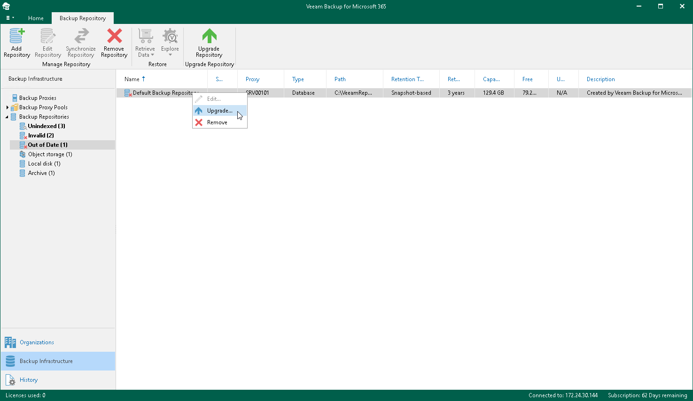

# Upgrading Backup Repositories

When you upgrade Veeam Backup for Microsoft 365 from version 7.0 or 7a to version 8.3, all backup repositories configured in your environment are marked as Out of Date and must be upgraded manually.

|  |
| --- |
| Note |
| If you upgrade Veeam Backup for Microsoft 365 from version 8 or 8.x to 8.3, all backup repositories configured in your environment will be upgraded automatically right after upgrading backup proxy servers. For more information, see [Upgrading Backup Proxy Servers](vbo_upgrading_proxy_server.md). |

To upgrade a backup repository, do the following:

1. Open the Backup Infrastructure view.
2. In the inventory pane, select the Backup Repositories > Out of Date node.
3. In the preview pane, do one of the following:

* Select a backup repository and click Upgrade Repository on the ribbon.

* Right-click a backup repository and select Upgrade.

If you want to stop upgrade, click Stop Upgrade on the ribbon.

Related Topics

[Indexing Backup Repositories](indexing.md)

