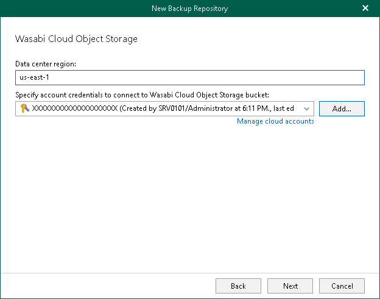

In this article

At this step of the wizard, select a datacenter region and specify account credentials for your Wasabi Cloud Object Storage.

1. In the Data center region field, specify a region.
2. From the Specify account credentials to connect to Wasabi Cloud Object Storage bucket drop-down list, select user credentials to access your Wasabi Cloud Object Storage.

If you already have a credentials record that was configured beforehand, select such a record from the drop-down list. Otherwise, click Add and provide your access and secret keys. For more information, see [Adding S3 Compatible, IBM Cloud and Wasabi Cloud Storage Access Key](s3_compatible_access_key.md). You can also click Manage cloud accounts to [manage existing credentials records](edit_remove_cloud_creds.md).

Page updated 8/26/2024

Page content applies to build 8.3.0.2201
