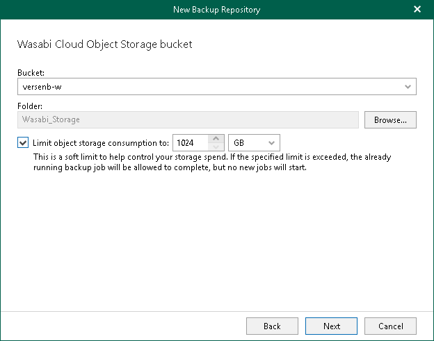

# Step 6. Specify Object Storage Bucket

At this step of the wizard, specify object storage bucket and folder where you want to save your data.

1. From the Bucket drop-down list, select a bucket.

Make sure that the bucket you want to use to store your data was created in advance; Veeam Backup for Microsoft 365 does not support creating new buckets.

1. In the Folder field, select a folder to which you want to map your object storage repository, and which will be used to store backups.

To select a folder, click Browse and either select an existing folder or create a new one by clicking New Folder.

For more information on how data is stored, see [Object Storage Repository Structure](object_storage_structure.md).

1. Select the Limit object storage consumption to check box and specify the limit value in GB, TB or PB.

If you select this check box, Veeam Backup for Microsoft 365 limits capacity of the object storage repository and prohibits running new jobs when the specified value is exceeded.

